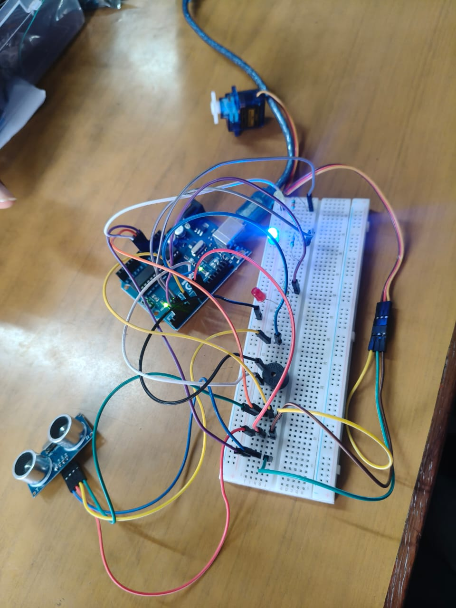

# Arduino-Based Distance Indicator

**1\. Title**  
 Arduino-Based Ultrasonic Distance Indicator

**2\. Problem Statement**  
 Manual monitoring of distance can be difficult and may lead to accidents. A simple system is needed to detect nearby objects and indicate the distance using LED signals.

**3\. Aim**  
 To design an Arduino-based system that detects nearby objects using an ultrasonic sensor and indicates the distance through LEDs.

**4\. Components Required**

* Arduino Uno  
* HC-SR04 Ultrasonic Sensor  
* Red LED  
* Yellow LED  
* Blue LED  
* 330Ω Resistors  
* Breadboard  
* Jumper wires  
* USB cable

**5\. Working Principle**  
 The ultrasonic sensor sends ultrasonic waves and receives the reflected waves from an object. Arduino calculates the distance based on the time taken for the echo to return. According to the detected distance, the appropriate LED is switched ON.

**6\. LED Indication**

| Distance | LED | Indication |
| ----- | ----- | ----- |
| Above 30 cm | Blue | Safe |
| 15–30 cm | Yellow | Warning |
| Below 15 cm | Red | Danger |

**7\. Conclusion**

* The Arduino-based distance indicator detects nearby objects using an ultrasonic sensor and indicates the detected distance through different LEDs.

 

